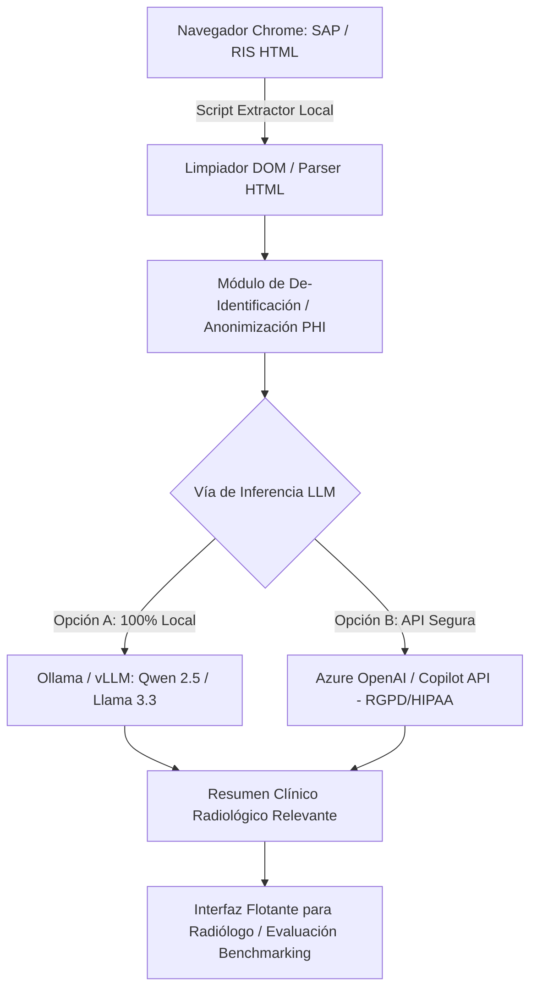

# Benchmarking de LLMs para el Resumen Automatizado de Historia Clínica en Radiología (RIS / SAP)

## 📌 Visión del Proyecto
Proyecto orientado al desarrollo de un **script local de extracción masiva/directa de texto de historia clínica del paciente desde la interfaz HTML de SAP / RIS en Google Chrome**, para posteriormente generar un **resumen clínico radiológico relevante** mediante dos vías comparativas:
1. **LLM de Despliegue Local (On-Premise)** (ej. Ollama / vLLM corriendo modelos open-source como Qwen 2.5, Llama 3.3, DeepSeek R1 Distill en GPU local del hospital).
2. **LLM Corporativo / API Segura (RGPD & HIPAA Compliant)** (ej. Azure OpenAI / Copilot Enterprise con canal cifrado y política de no-retención de datos).

El objetivo es emular y extender el estudio pionero de ***Serapio et al., Radiology 2026***, comparando la precisión, exhaustividad, factibilidad y utilidad clínica del resumen automatizado para el radiólogo frente a la indicación habitualmente proporcionada por el clínico peticionario.

---

## 📄 Artículo de Inspiración de Referencia
- **Título**: *Radiologically Relevant Clinical History Summarization with Large Language Models: A Multireader Performance Study*
- **Autores**: Adrian Serapio, Timothy L. Chen, Jae Ho Sohn et al. (UCSF)
- **Publicación**: *Radiology 2026; 320(2):e253238*
- **Ubicación en el repositorio**: [`serapio_et_al_2026_radiologically_relevant_clinical_history_summarization.pdf`](file:///c:/Users/Guillem/OneDrive%20-%20Generalitat%20de%20Catalunya/05_Proyectos/ris_llm_clinical_summary/serapio_et_al_2026_radiologically_relevant_clinical_history_summarization.pdf)

### Principales hallazgos del artículo para nuestra metodología:
1. **Dataset e Ingesta**: Extracción de las 10 notas clínicas más recientes del paciente previas al estudio.
2. **Modelos Evaluados**: Claude 3.5 Sonnet (mejor propietario) y Qwen 2.5-7B Instruct (mejor open-source).
3. **Métricas de Evaluación**:
   - *Automatizadas*: ROUGE, MEDCON, RADGRAPH, BERTScore.
   - *Juicio Clínico (Likert 1-5)*: Exhaustividad (Comprehensiveness), Facticidad/Ausencia de Alucinaciones (Factuality), Concisión (Conciseness).
   - *Utilidad en Workflow*: Utilidad para elegibilidad/protocolado de la prueba y utilidad para la interpretación diagnóstica.
4. **Resultado clave**: La **exhaustividad** es el factor que más influye (65.77%) en la preferencia del radiólogo.

---

## 🗂️ Estructura del Directorio
```
ris_llm_clinical_summary/
├── README.md                 <-- Información general y arquitectura
├── serapio_et_al_2026_...pdf <-- Artículo Radiology 2026 de referencia
├── docs/                     <-- Notas de diseño, esquemas y prompts
├── data/                     <-- (Git-ignored) Datos extraídos / Muestras anonimizadas
│   ├── raw_html/             <-- Capturas HTML de SAP/Chrome
│   └── processed_text/       <-- Textos limpios y anonimizados
├── src/                      <-- Código fuente del proyecto
│   ├── scraper/              <-- Script de extracción Chrome / SAP HTML (Selenium/Playwright/DOM)
│   ├── anonymizer/           <-- De-identificación de PHI/PII (RGPD/HIPAA)
│   ├── llm_engine/           <-- Conectores para Ollama (Local) y Azure/Copilot API
│   └── evaluator/            <-- Scripts de benchmarking (ROUGE, BERTScore, etc.)
└── results/                  <-- Tablas comparativas y análisis estadísticos
```

---

## 🎯 Arquitectura Técnica Propuesta



---

## 🚀 Fases del Proyecto

### **Fase 1: Análisis de la Interfaz SAP HTML y Diseño del Extractor**
- Inspectar la estructura DOM/HTML de SAP cargada en Google Chrome (tablas de curso clínico, antecedentes, informes previos).
- Desarrollar un script en Python (Playwright / BeautifulSoup / Chrome DOM Parser) que extraiga el texto limpio relevante de las notas del paciente.

### **Fase 2: Módulo de Anonimización Local (RGPD / HIPAA)**
- Implementar de-identificación local (filtro de Nombres, DNI/NHC, Fechas exactas, Médicos) previa a cualquier envío a API o almacenamiento.
- Asegurar aislamiento total de los datos en entorno local.

### **Fase 3: Implementación de los Motores LLM (Local vs API)**
- **Motor Local**: Integrar cliente Python con Ollama / vLLM ejecutando modelos locales (Qwen 2.5 7B/14B/72B, Llama 3.3 70B, DeepSeek R1 Distill).
- **Motor API RGPD**: Integrar Azure OpenAI API / Copilot Enterprise con endpoint corporativo verificado.
- Diseñar el **Prompt Estandarizado** guiado por los criterios de *Serapio et al. Radiology 2026*.

### **Fase 4: Prueba Piloto e Inferencia en Lote**
- Captura de una serie prospectiva/retrospectiva de historias clínicas radiológicas.
- Generación paralela del resumen con Motor Local vs Motor API.

### **Fase 5: Estudio de Evaluación y Benchmarking (Lectura a Ciegas)**
- Medición de tiempos de ejecución y respuesta.
- Evaluación cuantitativa (ROUGE, BERTScore, MEDCON).
- Evaluación cualitativa a ciegas por radiólogos (Puntuación Likert en Exhaustividad, Facticidad, Concisión y Utilidad para Protocolar e Interpretar).

## 💻 Cómo ejecutar el flujo en Google Chrome (Menú Contextual Clic Derecho)

### 1. Iniciar el Servidor Local Backend (Python)
Haz doble clic en **[`iniciar_servidor.bat`](file:///c:/Users/Guillem/OneDrive%20-%20Generalitat%20de%20Catalunya/05_Proyectos/ris_llm_clinical_summary/iniciar_servidor.bat)** (o ejecuta `python server.py` en la terminal).

### 2. Cargar la Extensión en Google Chrome (1 sola vez)
1. Abre **Google Chrome** y navega a `chrome://extensions/`.
2. Activa el **Modo de desarrollador** (arriba a la derecha).
3. Haz clic en **Cargar descomprimida** (*Load unpacked*).
4. Selecciona la carpeta:
   `05_Proyectos/ris_llm_clinical_summary/chrome_extension`

---

## 🖱️ Flujos de Trabajo Disponibles con Clic Derecho

1. En la pantalla de **SAP / RIS** en Google Chrome, haz **clic derecho en cualquier parte de la página**.
2. En el menú desplegable que aparece, selecciona la opción deseada:

### **Opción A: 🚀 Abrir Copilot Chat Web y AUTOPEGAR Prompt Anonimizado**
- **Extrae** la historia clínica de SAP.
- **Anonimiza** en local todos los datos sensibles (cumplimiento RGPD/HIPAA).
- **Abre automáticamente** una nueva pestaña con la URL corporativa:  
  `https://m365.cloud.microsoft/chat?auth=2&home=1&from=ShellLogo`
- **Detecta cuando la página carga completamente** y **pega automáticamente** el prompt listo en la ventana de chat del usuario.
- Muestra una notificación en verde: *"✨ ¡Historia clínica anonimizada pegada en Copilot! Pulsa Enter para enviar."*

### **Opción B: 🚀 Inferencia Local (Ollama) / ☁️ API Corporativa**
- Procesa el resumen directamente en la pantalla de SAP sin abrir otras pestañas, desplegando un panel lateral flotante con el resumen estructurado en 15 segundos.

